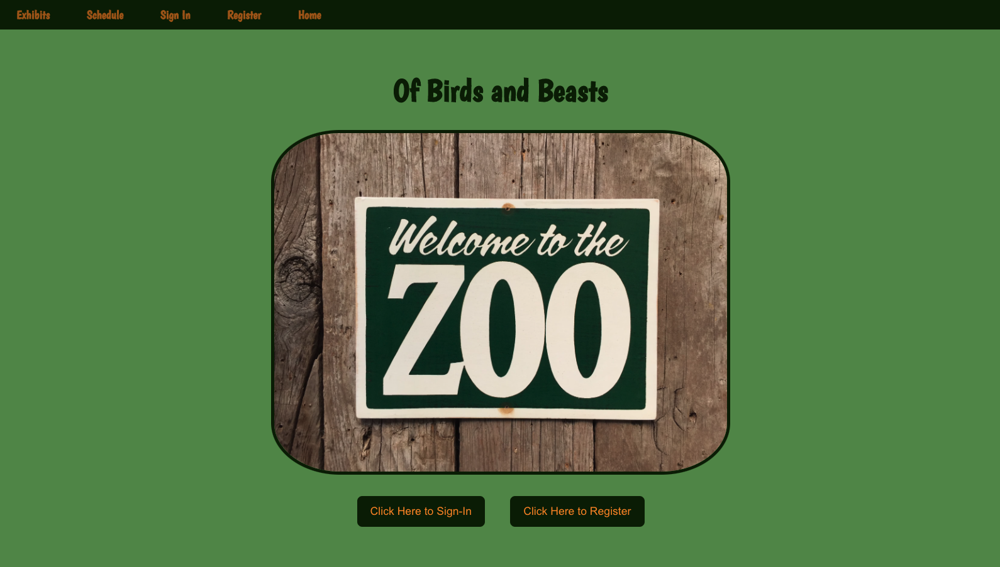
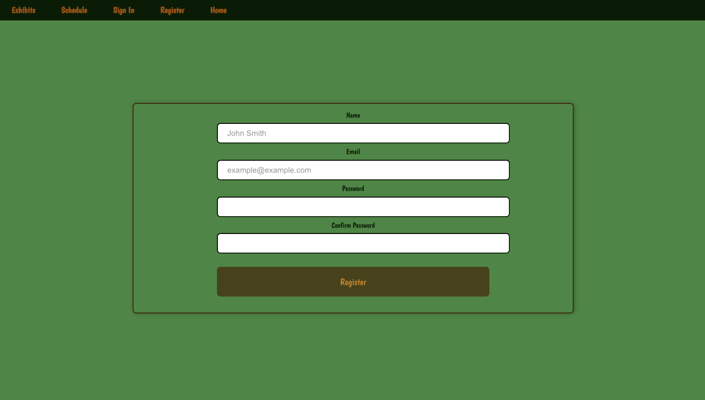
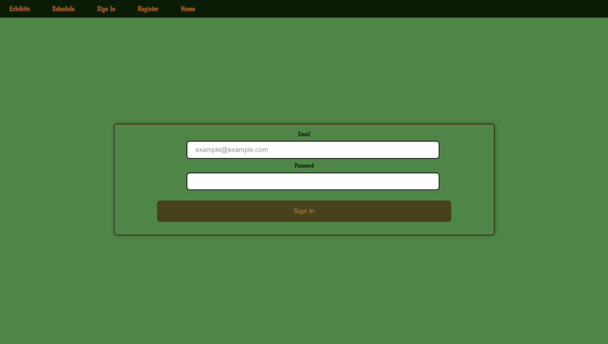
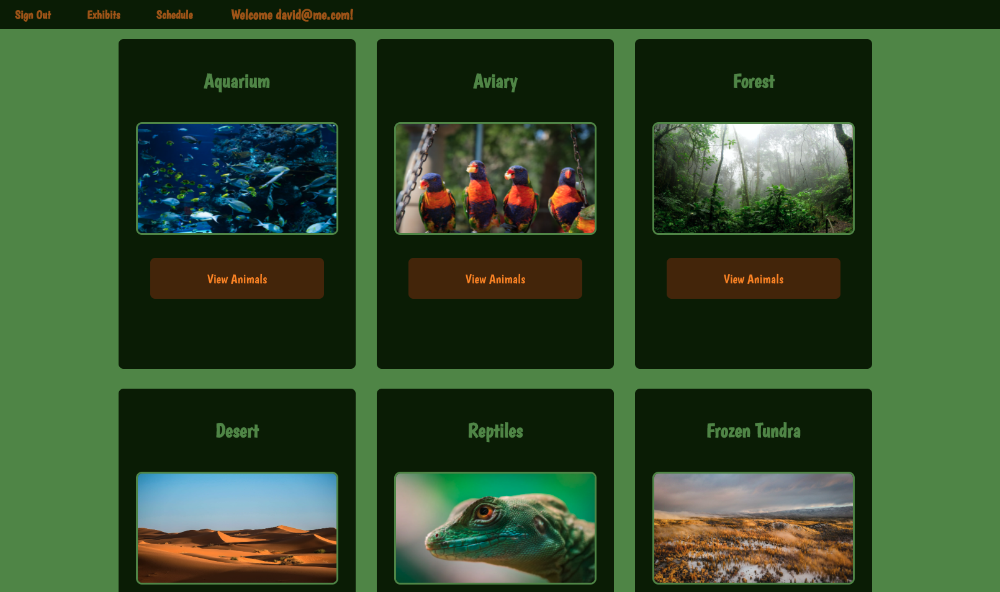
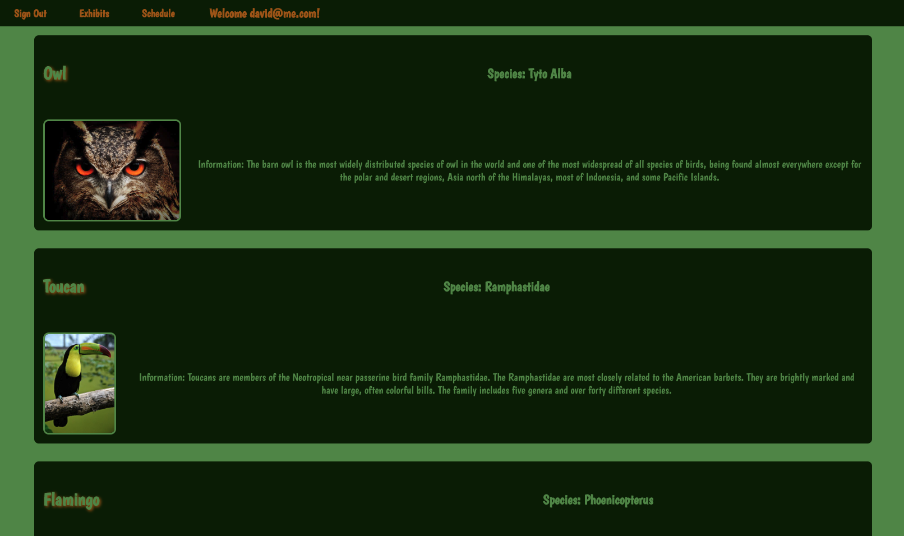
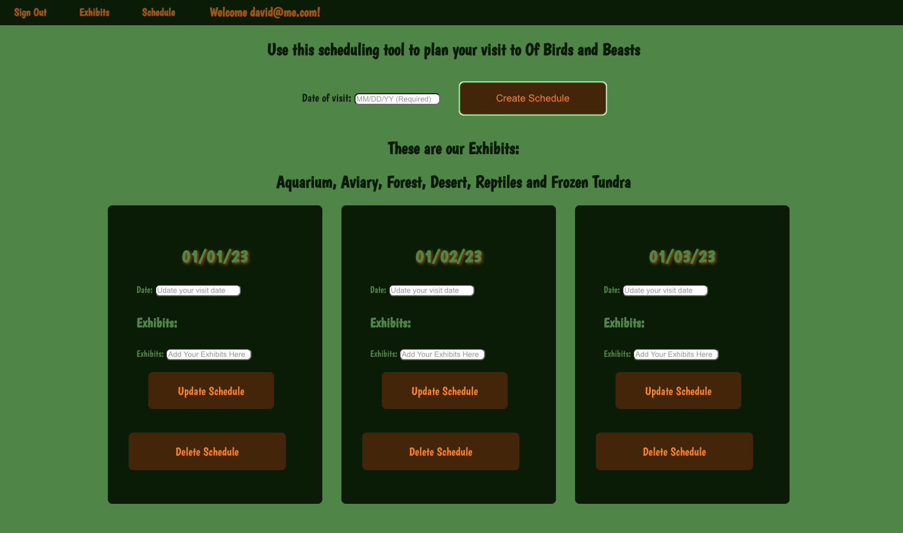

# Of-Birds-And-Beasts

## Date: 11/18/2022

### By: David Caldwell, Jaelen Venable, Marley Judd, Olivia Schwartz

---

---

### **_Description_**

#### This project is a full-stack application that utilizes Postresql, Express, React and Node. This application has user authentication with JWT that allows a user to login and plan their day at the Zoo, Of Birds and Beasts. Once logged in, the user can view different exhibits and see what animals are in each one. From there, a user can add exhbits to their schedule.

---

### **_Technologies Used_**

- GitHub
- VS Code
- Heroku
 - [Deployed Front End](https://of-birds-and-of-beasts.herokuapp.com/)
 - [Deployed Back End](https://pure-citadel-98901.herokuapp.com/)
- Insomnia
- PostreSQL
- Sequelize
- Trello
  - [Trello Board Here](https://trello.com/b/fQVpFC3c/u3project)
- Component Hierarchy Diagram
  - [Component Hierarchy Here](https://app.diagrams.net/#G1c1F1iYe4uwBbfWv5glKVj9d1bf8z17tH)
- ERD
  - [ERD Here](https://app.diagrams.net/#G1Uj7JKQTusMBAehPCcaLVUnKKjAwQoX6E)
- Back End Repository
  - [Back-End Repository Here](https://github.com/OliviaSchwartz/Of-Birds-And-Beasts-Back-End)
  - [Front-End Repository Here](https://github.com/OliviaSchwartz/Of-Birds-And-Beasts)

---

### **_Getting Started_**

#### Once at the landing page, choose to register, and from there make sure you login. Once logged in, explore the different animal exhibits to get an idea of what animals you'd like to see. When you're ready to plan your visit, navigate to the Schedule to create a schedule and add the exhibits, change the date of your schedule, or delete a schedule that you no longer need.

---

### **_Screenshots_**

---

#### Register Page

---

#### Signin Page

---

#### Exhibits Page

---

#### Animals Page

---

#### Schedules Page

---

### **_Future Updates_**

- [] Buttons to add Exhibit to Schedule
- [] Update more than Date on Schedule
- [] Change welcome from email to Patron name

---

### **_Credits_**

[Wikipedia](https://en.wikipedia.org/wiki/Wiki) - all animal information

[Pexels](https://www.pexels.com/) - all images

[Sequelize](https://sequelize.org/)

[MDN Docs](https://developer.mozilla.org/en-US/)

[W3Schools](https://www.w3schools.com/)

[Stack Overflow](https://stackoverflow.com/)
